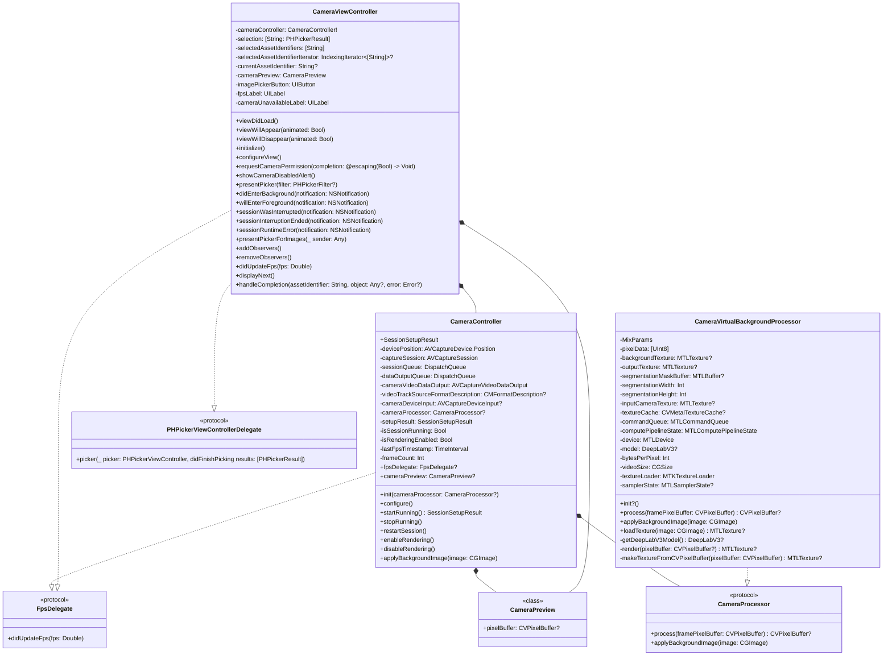

# Sample application to apply custom virtual backgrounds

## Table of Contents

1. [Introduction](#introduction)
2. [Class Diagram](#class-diagram)
3. [Camera Capturing](#camera-capturing)
4. [Camera Preview Rendering](#camera-capturing)
5. [Applying Virtual Background](#applying-virtual-background)
6. [Demo](#demo)

## Introduction

This project leverages Core ML body segmentation to replace the background in real-time on iOS devices. Using deep learning model, it accurately detects and segments the human figure, allowing users to apply custom virtual backgrounds. Optimized for performance, it ensures smooth processing on mobile devices.

## Class Diagram

## Camera Capturing

Camera capturing for iOS utilizes the `AVFoundation` framework to manage and configure the camera hardware, capture video and audio data, and process the captured data. The `CameraController` class is responsible for setting up capture session (`AVCaptureSession`) it's the core component that manages the flow of data from the input devices (camera and microphone) to the outputs (video and audio data). 

In this implementation, the controller focuses solely on video capture. It starts with seting up the capture session on a background queue (`sessionQueue`), configures the session preset, adds the camera input, and sets up the video data output. The `startRunning` and `stopRunning` methods start and stop the capture session on the `sessionQueue`. 

Each time a new video frame is captured, the `captureOutput` method is triggered, processing the frame and updating the frames per second (FPS) in real time.

## Camera Preview Rendering

The `CameraPreview` class is a custom `MetalKit` view that renders video frames captured by the camera. It manages the `Metal` device, command queue, render pipeline state, and texture cache. The class handles the creation of `Metal` textures from pixel buffers, sets up the necessary transformations for rendering, and encodes the rendering commands. The draw method is responsible for rendering the video frames on the screen, and the `setupTransform` method updates the transformation settings based on the texture dimensions, view bounds, mirroring, and rotation.

The `PassThrough.metal` file contains the vertex and fragment shaders used by the `CameraPreview` class to render video frames. The vertex shader processes the vertex positions and texture coordinates, while the fragment shader samples the texture to determine the color of each pixel. The `CameraPreview` class sets up the render pipeline state with these shaders, prepares the vertex and texture coordinate buffers, and issues draw commands to render the video frames using `Metal`. This setup allows for efficient and high-performance rendering of video frames captured by the camera.

## Applying Virtual Background

The `CameraVirtualBackgroundProcessor` class is responsible for processing video frames to apply a virtual background using `CoreML` and `Metal`. It implements the `CameraProcessor` protocol, which defines methods for processing video frames and applying a background image. The implementation uses the `DeepLabV3` model for semantic image segmentation to separate the foreground (a person) from the background in video frames. The model is loaded using `CoreML`, and the segmentation mask generated by the model is used to blend the input frame with a virtual background image. This process involves resizing the input frame, running the segmentation model, creating a Metal buffer for the segmentation mask, and using a compute shader to render the final output. This class leverages the GPU for efficient real-time video processing, making it suitable for applications such as virtual backgrounds in video conferencing or live streaming.

Here’s how it works:

1. **Initialization**: This initializer sets up a Metal-based image processing pipeline. It creates a `Metal` device and command queue, loads the `mixer` compute shader from `Mixer.metal` file, and sets up a compute pipeline. A texture cache is initialized to convert pixel buffers into `Metal` textures, and an output texture is created for GPU processing. Also the `pixelData` array is created as a buffer to store raw pixel values which is used later to copy `outputTexture` data into `pixelBuffer`.

2. **Resizing the Frame**: The `process` method checks if `backgroundTexture` is not available then it returns `framePixelBuffer`, which represents the frame captured by the camera but if it's available then it resizes the input pixel buffer frame to match the dimensions (`513`x`513`) expected by the model, it uses `resizePixelBuffer` utility function to resize `CVPixelBuffer` to specified dimensions without preserving the aspect ratio. It extracts a region from the source buffer and scales it using the `Accelerate` framework's `vImage` API for efficient resizing. The function handles pixel format consistency, and creates a new `CVPixelBuffer` with the resized image data, then it loads and runs the model to generate the segmentation mask.

3. **Loading the Model**: The `DeepLabV3` model is loaded using the `getDeepLabV3Model` method, which lazily initializes the model with a configuration when first time used. The model can label image regions into 21 semantic classes, including categories such as bicycle, bus, car, cat, person, and more, with the background considered as one of the classes. The model input is a color image of size `513`x`513` pixels. When you input an image of size `513`x`513`, the output is a segmentation mask. Specifically, the model produces a mask where each pixel is assigned a class label corresponding to the object or background category it belongs to. The output mask is typically in the form of a tensor with the shape (`height`, `width`, `num_classes`), where `height` and `width` correspond to the dimensions of the input image (`513`x`513`), and `num_classes` is the number of categories the model was trained on (`21` for `DeepLabV3`). The semantic class index for the `person` category is `15`.

4. **Generating the Segmentation Mask**: The model's `prediction` method is called with the resized input frame to generate the segmentation mask. This mask is then copied into a `Metal` buffer for use in the compute shader.

5. **Rendering the Frame**: The `render` method uses a compute shader to blend the input video texture with a virtual background texture based on a segmentation mask. The method sets up the necessary textures, buffers, and sampler states, dispatches the compute kernel, and commits the command buffer for execution. The compute shader in `Mixer.metal` performs the blending operation by checking the segmentation mask and combining the input and background textures accordingly. The result is available as `outputTexture`. This process enables real-time virtual background processing for video frames.

6. **Displaying the Frame**: The final step of the `process` method is to copy the output texture data into the pixel buffer and return it for displaying on the screen using the `CameraPreview` class, the process of which was explained in the Camera Preview Rendering section.

## Demo

https://github.com/user-attachments/assets/96686316-3284-41f2-9f14-97fa5197d0da

## Like This Project? Fuel It with a Coffee! ☕

